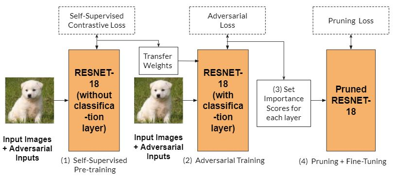

# Making Neural Networks Robust in Resource Constrained Settings

In this work, we proposed a solution to achieve a robust and compact model that can be deployed in a resource-
constrained environment. In all 4 steps of our approach, we include natural (on clean samples) and robust (on adversarial samples) training loss for parameter optimization. To boost the robustness, we utilize robust contrastive learning and transfer the weights to initialize our model before supervised learning. We learn the pruning mask by incorporating importance scores in the robust objective function, using which we are able to preserve the robustness. We compare our method with strong baselines and their variants for thorough study. Because of our elegant 4 step method, solving different resource-constraint problems at each stage, we achieve best performance throughout all our experiments. We test our method with different pruning ratios, i.e., 0% after supervised training stage, 90% and, 99% and our method outperforms others at every stage. Moreover, with different types of attacks, i.e., white-box (PGD) and black-box, our observations remain consistent. With extensive experiments and solid reasoning of our method, we have established strong dominance over baseline and
variants, providing a reliable method for deployment.

## Overview of the method


We perform the following: <br/>
(1) Pre-training using Self-Supervised Robust Contrastive loss. <br/>
(2) Supervised adversarial training using Adversarial Loss. <br/>
(3) Set importance scores for each of the trained layers. <br/>
(4) Perform pruning using a pruning loss and finally adversarial fine-tuning of pruned weights.

## Results

### Final accuracy (clean and robust) scores of our method against baselines on the CIFAR-10 dataset.
| Method                         | Clean Acc(\%) | Robust Acc(\%) |
|--------------------------------|---------------|----------------|
| Baseline 1-RoCL (Not pruned)   | 77.85         | 31.45          |
| Baseline 2-HYDRA (90\% Pruned) | 69.84         | 41.74          |
| Our method (90\%Pruned)        | 76.66         | **48.68**      |


### Black box attack performance
| Method                        | Robust Acc(\%) |
|-------------------------------|----------------|
| Baseline 2 (w/o adv training) | 10.01          |
| Baseline 2                    | 16.83          |
| Our method (w/o adv training) | 13.08          |
| Baseline 1 + Baseline 2       | 17.99          |
| Our method                    | **18.80**      |

**You can more detailed results in our [report](https://drive.google.com/file/d/1RWaGpMLMrfauIsgzrBdCfULZ9BIJlSN8/view?usp=sharing)**.

## Creating Docker

The docker file and basic requirements files are already present. Update `Dockerfile` and `requirements.txt` according to need.
We need to create and then upload the docker image to docker hub, to be able to use it in HTcondor.

### 1. Create docker image
```
sudo docker build -f Dockerfile -t mlcysec-docker .
```

### 2. Create docker container (optional)
```
sudo docker container run --name test -it mlcysec-docker
```

### 3. Login to hub
```
sudo docker login
```

### 4. Change tag according to name convention of hub
```
sudo docker tag mlcysec-docker nik1806/mlcysec:1.0
```

### 5. Push to hub
```
sudo docker push nik1806/mlcysec:1.0
```

## Create an ssh session to a running job
Useful commands

### 1. Go to job location
```
condor_ssh_to_job <job_id>
...
logout
```
### 2. Fetch files from job location
```
condor_ssh_to_job -ssh sftp <job_id>
...
sftp> get outputfile.dat
```


## RoCL    

### Evaluation
1. Run the first step of the total_process bash script while passing the trained model for linear classifier training.
2. Previous step gives two models. Now, run the next two steps for robustness evaluation. 
3. Previous step outputs robustness evaluation performance for two epsilon values.


## HYDRA    

There three parts (steps) in HYDRA method. We have to uncomment and run each part sequentially (due to condor).

### Executing code
1. Place the command in `executable_cmd.sh`
2. Update `docker.sub` according to the requirements.
3. Run: `condor_submit docker.sub` (include `-i` flag for interactive mode) 

### Using RoCL adversarial trained weights
1. Include flags `--load_RoCL` with option of parameter `complete` to use with linear layer and parameter `extractor` to use without linear layer.
2. Specify the checkpoint path, e.g. `--source-net ./trained_models/rocl_ckpt_same_attack`.
3. Execute code.

### Black box attack
1. Specify the checkpoint path, e.g. ` --source-net ./trained_models/rocl_ext_adv_base/finetune/latest_exp/checkpoint/checkpoint.pth.tar`.
2. Use the flag ` --black_box_eval`.
3. Execute code/experiment.

## Transfer attack
We create adversarial examples with PGD white-box attack with ResNet-20 auxiliar model. This attack will be considered as black-box attack on HYDRA models.

Create test data using below:
```
python pgd_transfer_attack.py
```

## Experiment results
You can find all results logs in `exp/` directory.